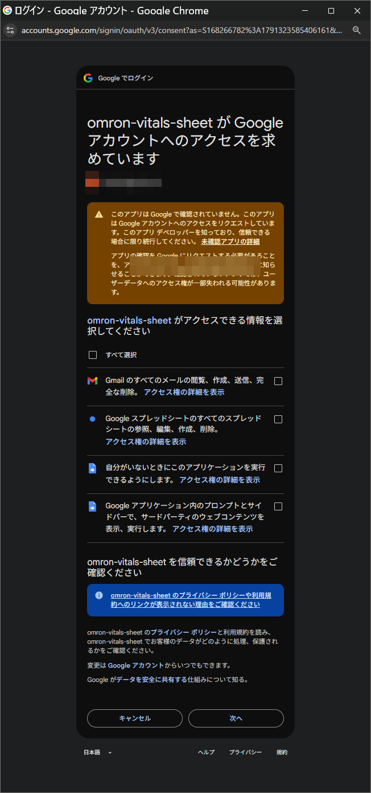
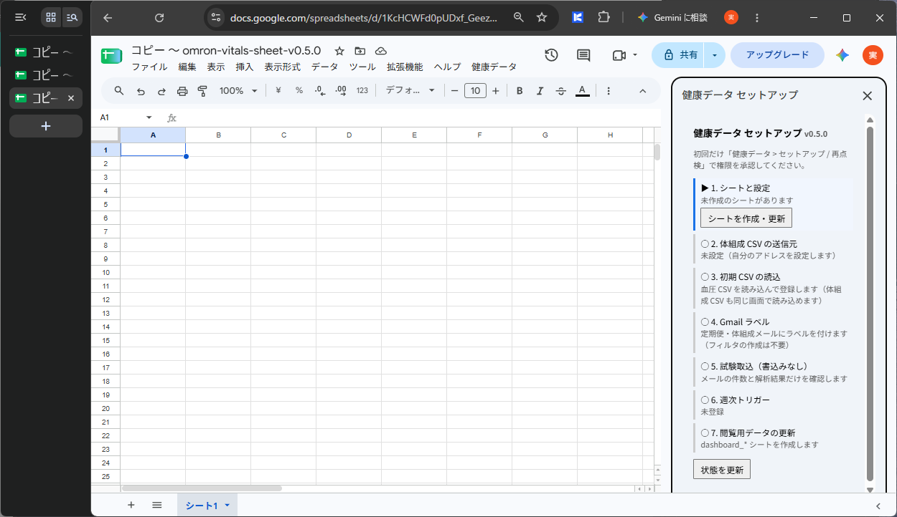

# 3. 権限の承認

取込用のプログラムが Gmail やスプレッドシートを使えるように、最初に一度だけ許可します。

## 手順

1. メニュー **健康データ → セットアップ ウィザード…** を選びます。
2. 「承認が必要です」と表示されたら **続行**（または「OK」）を押し、使う Google アカウントを選びます。
3. 「**omron-vitals-sheet が Google アカウントへのアクセスを求めています**」という画面が表示されます。
   アカウント名の下に「このアプリは Google で確認されていません」という警告が出ます（理由は下記）。
4. **すべて選択** にチェックを入れ、4 つの項目すべてにチェックが付いたことを確認して **次へ** を押します。

    { .img-medium }

5. 画面の右側に「健康データ セットアップ」が表示されます。上から順に進めます。
    1. **1. シートと設定** の **シートを作成・更新** を押します。必要なシート一式が作られます。
    2. **2. 体組成 CSV の送信元** を実行します。ご自身のメールアドレスが自動で設定されます。

    { .img-large }

!!! warning "一部だけにチェックを付けた場合"
    チェックを外した項目に関係する処理は、エラーになって止まります。
    やり直すときは、もう一度メニューから **健康データ → セットアップ / 再点検** を実行すると、承認画面が再び表示されます。

!!! note "警告が「詳細」の画面として出る場合"
    Google の画面の都合で、上の画面の前に「Google はこのアプリを確認していません」という画面が単独で表示されることがあります。
    その場合は **詳細** → **omron-vitals-sheet（安全ではないページ）に移動** を押すと、上の画面に進みます。

## 警告が表示される理由

このツールは個人が配布しているもので、Google の審査（OAuth 検証）を受けていません。
そのため Google が「確認されていないアプリ」として警告を表示します。

- 警告に表示される「アプリ デベロッパー」は、**あなた自身のアドレス**です。コピーしたプログラムの持ち主があなたになるためです。
- プログラムは外部への送信を行いません。データはご自身のアカウント内だけで処理されます。
- プログラムの全文は、メニュー **拡張機能 → Apps Script** から確認できます。
- 不安な場合は、**キャンセル** を押して中止してください。

## 承認画面の 4 項目

| 承認画面の表示 | 実際の使いみち |
|---|---|
| Gmail のすべてのメールの閲覧、作成、送信、完全な削除 | 定期便メールと体組成 CSV メールを探して読む。取込済みの目印として**ラベルを作成・付与**する |
| Google スプレッドシートのすべてのスプレッドシートの参照、編集、作成、削除 | このスプレッドシートに、取り込んだデータと集計・グラフを書き込む |
| 自分がいないときにこのアプリケーションを実行できるようにします | 毎週月曜の自動取込（週次トリガー） |
| Google アプリケーション内のプロンプトとサイドバーで、サードパーティのウェブコンテンツを表示、実行します | セットアップ ウィザードや CSV 読込の画面を表示する |

!!! note "Gmail の表示が「送信、完全な削除」になる理由"
    プログラムが使う Gmail の機能（Apps Script の GmailApp）は、Google の仕組み上、Gmail 全体への権限を求めます。
    そのため承認画面には「送信、完全な削除」まで表示されます。
    実際のプログラムは、メールの**検索・読み取り・ラベル付け**だけを行い、**送信・転送・削除はしません**。

詳しくは [プライバシーポリシー](../privacy.md) をご覧ください。

次へ: [4. 初回 CSV の登録](initial-csv.md)
