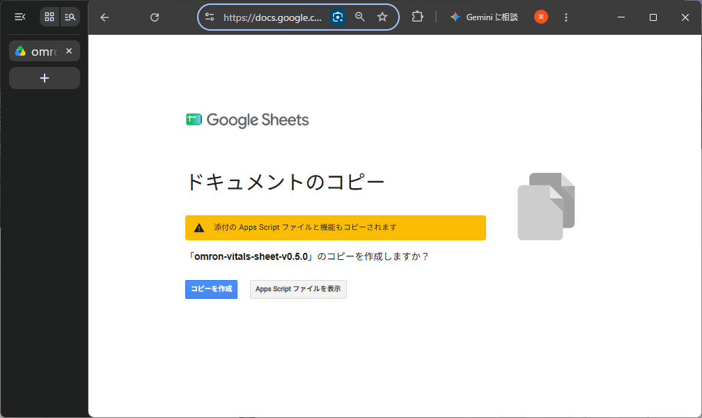

# 2. テンプレートをコピー

!!! warning "Google アカウントを 1 つだけにしてください"
    ブラウザで複数の Google アカウントに同時にログインしていると、メニュー **健康データ** が表示されないことがあります。
    使うアカウント以外はログアウトするか、Chrome のシークレット ウィンドウ（または別のプロファイル）で、
    使うアカウントだけにログインしてから進めてください。

## 手順

1. 使う Google アカウントでログインした状態で、次のリンクを開きます。

    **[テンプレートをコピーする](https://docs.google.com/spreadsheets/d/1CUhu2sb1IOUV_gFyz5udJAwYBhSpUAHA9qNHFNmTu6w/copy)**

2. 「ドキュメントのコピー」の画面が表示されます。「添付の Apps Script ファイルと機能もコピーされます」と表示されるのは正常です。
   **コピーを作成** を押します。

    { .img-large }

3. ご自身の Google ドライブに「コピー 〜 omron-vitals-sheet-v0.5.0」という名前のスプレッドシートができて開きます。
   名前は自由に変えてかまいません。
4. 10 秒ほど待ち、上部のメニューの右端（**ヘルプ** の右）に **健康データ** が表示されることを確認します。
   表示されない場合は、ページを再読み込みしてください。それでも表示されない場合は、上の囲みのとおり
   ログインしているアカウントを 1 つにしてから開き直してください。

## コピーされるもの・されないもの

- **コピーされる**: スプレッドシートと、そこに入っている取込用のプログラム（Apps Script）。
- **コピーされない**: 開発者や他の利用者のデータ、自動取込の予約（トリガー）。
  データはこれから取り込み、自動取込はご自身で登録します。

コピーしたスプレッドシートとプログラムの持ち主は、あなた自身です。開発者はコピーを見ることも変更することもできません。

!!! warning "共有しないでください"
    このスプレッドシートには、これから健康データがたまります。**ご本人だけ**が見られる状態のまま使い、
    「リンクを知っている全員」への共有は有効にしないでください。

次へ: [3. 権限の承認](authorize.md)
